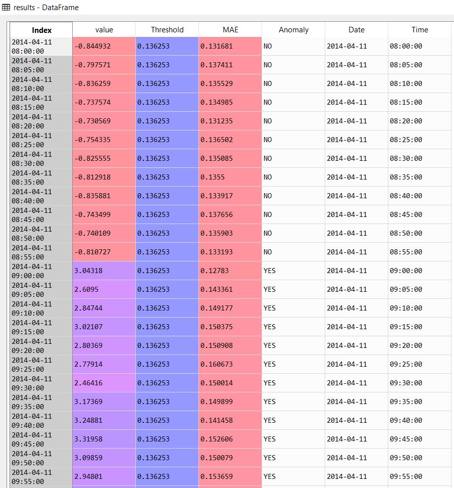

# ANOMALY DETECTION

# MOTIVATION
https://keras.io/examples/timeseries/timeseries_anomaly_detection/

# .py FILES

## 1- test_class_functions.py

All required functions are in this file. This file do complete testing on any test data. 

## 2- test_execution.py

Load any test dataset here and with the help of file # 1, the test dataset results are executed. 

## 3- main.py 

This is similar to the main code which trains the anomaly detection algorithm. 

# WORK REQUIRED
### Project Work [Start time - 11:30 AM - 1:10 PM] 

#### Stage-1  DONE
- Run code from the link shared: 
https://keras.io/examples/timeseries/timeseries_anomaly_detection/ 

Issues: 
1- dataset path changed. Fixed in the present code. 

2- Tensorflow latest version required to run the model. Refer to this link for the solution: https://github.com/tensorflow/tensorflow/issues/40937

#### Stage-2

##### Objective:

1- create function for the expected output file with the following columns  **DONE**

- group_id
- threshold
- MAE value
- Anomaly [yes/no]

2- validate by applying it on one of the test dataset groups

To do this, 
- we have to create a separate function class for the test dataset : **DONE**
- save trained model : **DONE**  reference: https://www.tensorflow.org/guide/keras/save_and_serialize
- load trained model: **DONE**
- check if the reload train model gives the same prediction as live trained model: still in progress as validity of the saved model is failing. **It is fixed**

**Stage-2 OUTPUT**

